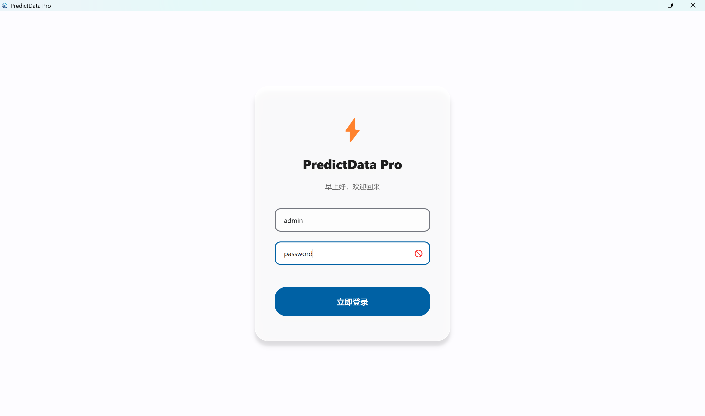
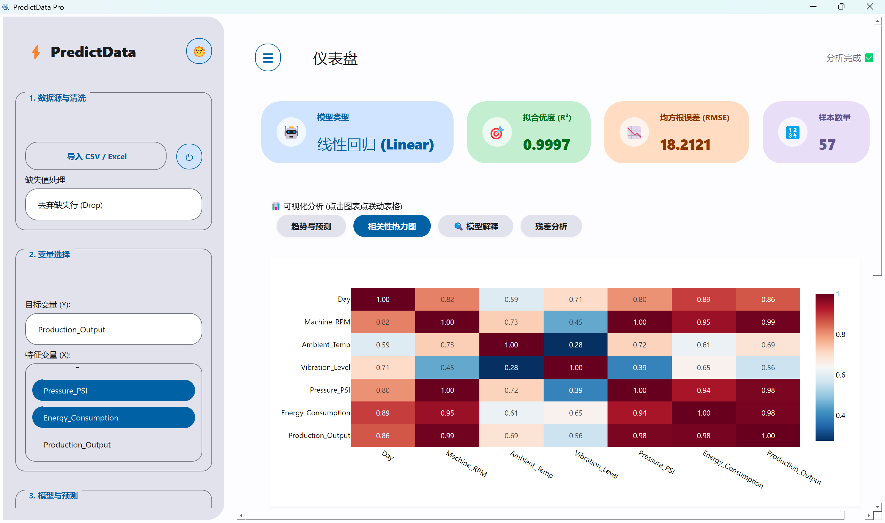
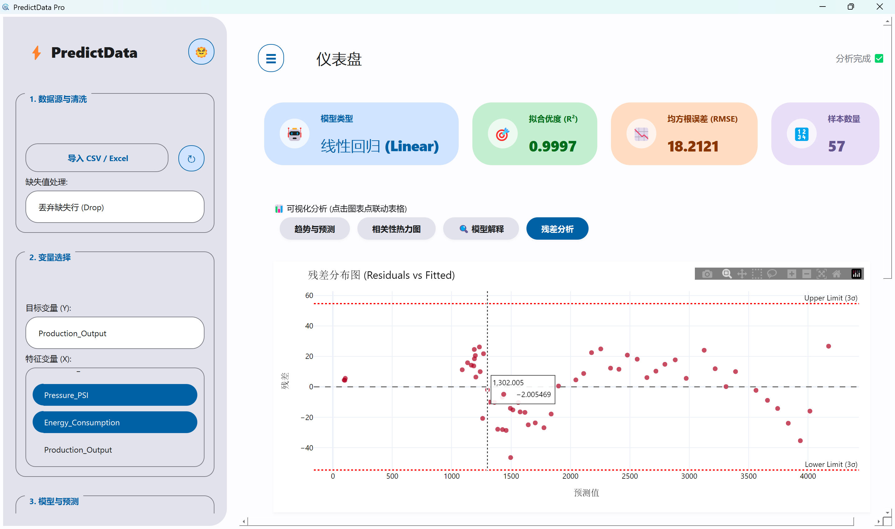
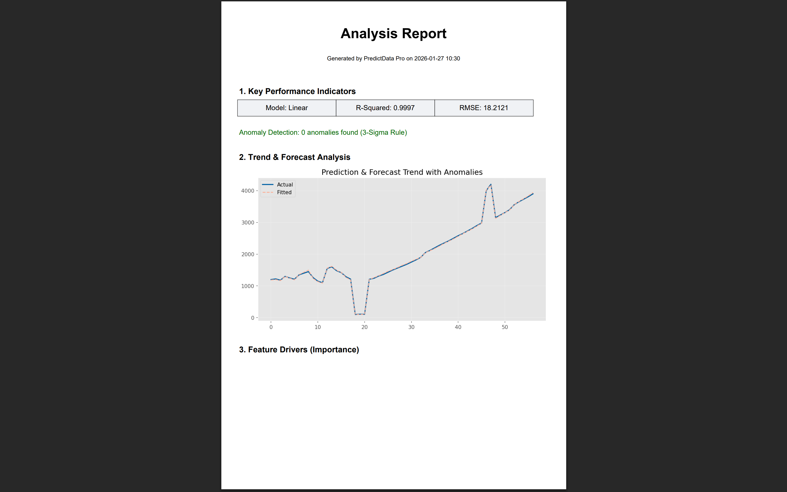

# 📈 EasyRegress


EasyRegress is a **no-code regression tool** for machine learning, built with Python and PyQt5.

It is designed for analysts, researchers, and students who need to make complex data predictions without writing a single line of code. From the data import and cleaning to model training and reporting, EasyRegress automates the entire workflow in a modern, fluid desktop interface.

---

## ✨ Features

*   **🖥️ Modern UI**: A sleek, responsive interface built with PyQt5, featuring **Dark/Light theme** toggling.
*   **🧹 Smart Data Cleaning**: Automatic handling of missing values via Drop, Mean Imputation, or Linear Interpolation strategies.
*   **🤖 Multi-Model Support**:
    *   Linear Regression
    *   Polynomial Regression
    *   Random Forest
    *   Support Vector Regression (SVR)
    *   **AutoML Mode**: Automatically trains multiple models and selects the best one based on R² score.
*   **📊 Interactive Visualization**: Powered by **Plotly**, offering zoomable, interactive trend lines, correlation heatmaps, and residual analysis.
*   **📑 One-Click Reporting**: Generate professional **PDF Reports** containing model metrics (RMSE, R²), feature importance, and forecast data.
*   **📦 Portable**: Runs as a standalone `.exe` file on Windows—no Python installation required.

---

## 📥 Download & Installation

### Run from Source
If you want to modify the code or run it on Linux/macOS:

1.  **Clone the repository**
    ```bash
    git clone https://github.com/Luobao0318/EasyRegress.git
    cd EasyRegress
    ```

2.  **Install Dependencies**
    (Requires Python 3.8+)
    ```bash
    pip install -r requirements.txt
    ```
    *Note: If you encounter errors regarding WebEngine, try running `pip install PyQtWebEngine` manually.*

3.  **Run the App**
    ```bash
    python main.py
    ```

---

## 🚀 Quick Start Guide

### 1. Login
*   **Username**: `admin`
*   **Password**: `password`

### 2. Workflow
1.  **Import Data**: Click "Import CSV / Excel" on the sidebar.
    *   *Sample Data*: You can use `factory_long_term_data.csv` provided in the repo for testing.
2.  **Clean Data**: Select a strategy (e.g., "Linear Interpolate" is best for time-series).
3.  **Variable Selection**:
    *   **Target (Y)**: The column you want to predict.
    *   **Features (X)**: The factors influencing the target. (If left empty, it predicts based on time index).
4.  **Train Model**:
    *   Select "AutoML" or a specific algorithm.
    *   Adjust the "Forecast Steps" slider.
    *   Click **🚀 Start Analysis**.
5.  **Export**: Save your results via "Export PDF Report" or "Save Model".

---

## 🖼️ Screenshots

| Login Screen | Dashboard & Analysis |
| :---: | :---: |
|  |  |

| Interactive Charts | PDF Report |
| :---: | :---: |
|  |  |

---

## 🛠️ Tech Stack

*   **GUI Framework**: PyQt5, PyQtWebEngine
*   **Data Processing**: Pandas, NumPy
*   **Machine Learning**: Scikit-learn, Joblib
*   **Visualization**: Plotly (Interactive), Matplotlib (Static/PDF)
*   **Build System**: PyInstaller, GitHub Actions

---

## ❓ FAQ & Troubleshooting

**Q: The charts are blank/white?**
A: This is usually due to missing `QtWebEngine` binaries.
*   If you are running from source, ensure `PyQtWebEngine` is installed.
*   If you are building it yourself, use `pyinstaller --collect-all PyQt5 ...`.
*   **Solution:** Download the official version from the **Releases** page, which fixes this issue.

**Q: PDF Export fails?**
A: The program generates temporary images for the PDF. Ensure the program has **write permissions** in its current folder (try running as Administrator or moving the folder out of C:\Program Files).

**Q: Text encoding issues (Garbled characters)?**
A: For best compatibility with the PDF generator, please ensure your CSV column headers use **English** or **Pinyin**.

---

## 🤝 Contributing

Contributions are welcome! If you have suggestions or find bugs, please open an [Issue](https://github.com/Luobao0318/EasyRegress/issues) or submit a Pull Request.

## 📄 License

This project is licensed under the [GPL-3.0 License](LICENSE).
